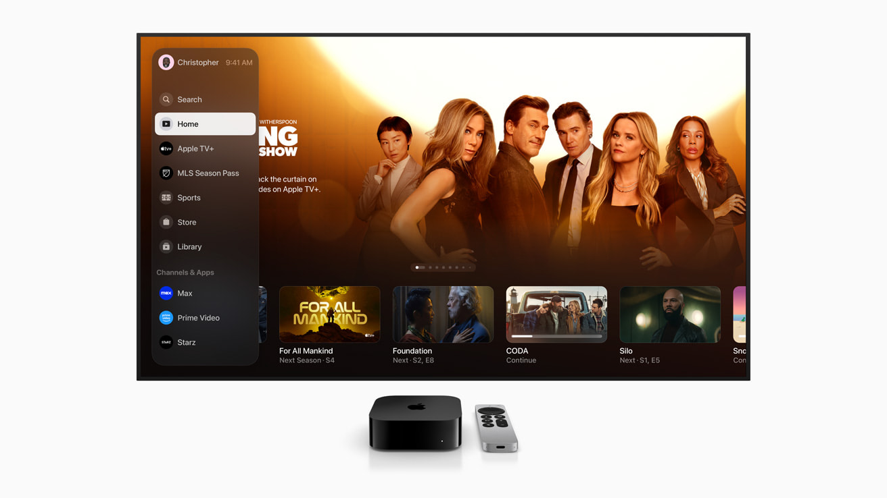
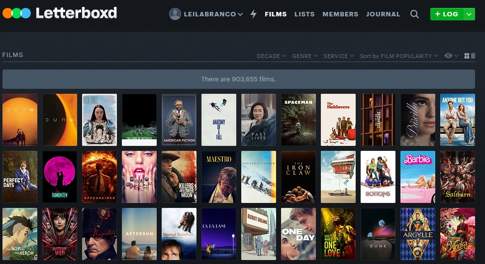

# Referências Visuais e de UI/UX

## 1. Apple TV+ (Descoberta e Home)

* **Onde foi utilizado:** Na página inicial (Home) e na estrutura dos cards de séries.
* **Por que é adequado:** A Apple TV+ utiliza um design minimalista com amplo respiro visual, fundos sólidos e tipografia marcante. Em vez de poluir a tela com dezenas de miniaturas, focamos em destacar a arte de poucas séries de cada vez. Isso passa uma sensação premium, limpa e facilita a descoberta do usuário sem sobrecarga de informações.

## 2. Notion (Lista de Episódios e Acompanhamento)

* **Onde foi utilizado:** Na página de detalhes da série, especificamente na listagem e marcação de episódios vistos.
* **Por que é adequado:** O Notion é referência em organização e produtividade. Utilizamos o conceito de checklist com linhas divisórias sutis e caixas de seleção (checkboxes) simples. Como o objetivo principal do MVP é o controle utilitário ("já vi ou não vi"), a interface de um gerenciador de tarefas se prova muito mais intuitiva e direta do que as interfaces tradicionais de aplicativos de streaming.

## 3. Letterboxd (Minha Lista e Organização Pessoal)

* **Onde foi utilizado:** Na área de séries salvas/favoritadas pelo usuário.
* **Por que é adequado:** O Letterboxd exibe um grid de pôsteres mudos, ou seja, apenas as capas sem textos ou sinopses abaixo delas. Como o usuário já está visualizando a sua própria coleção, informações textuais repetitivas são redundantes. Essa escolha reduz a carga cognitiva e deixa a interface focada no aspecto visual das obras salvas.